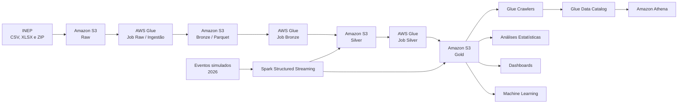

# Postech Challenge 2 — Análise da Alfabetização no Brasil

Repositório: [https://github.com/diego-nasc/postech-challenge-2](https://github.com/diego-nasc/postech-challenge-2)

### Contexto deo Problema

A alfabetização na infância constitui uma etapa fundamental para o desenvolvimento educacional e social. No Brasil, o **Compromisso Nacional Criança Alfabetizada** estabelece como objetivo garantir que as crianças estejam alfabetizadas ao final do 2º ano do ensino fundamental, além de apoiar a recomposição das aprendizagens dos estudantes afetados por defasagens educacionais.

O acompanhamento desse cenário depende da integração de diferentes informações educacionais. Resultados de avaliação, metas nacionais, estaduais e municipais e microdados de estudantes são publicados em arquivos com diferentes estruturas, granularidades e padrões de representação.

Essa fragmentação dificulta a construção de análises integradas e reproduzíveis. Comparar o desempenho observado com as metas educacionais, acompanhar a evolução temporal dos indicadores e identificar desigualdades territoriais exige um processo consistente de ingestão, padronização, validação e integração dos dados.

Neste contexto, o projeto propõe uma pipeline de engenharia de dados em nuvem para transformar dados públicos de alfabetização em datasets analíticos confiáveis, rastreáveis e preparados para análises estatísticas e futuras aplicações de Inteligência Artificial.

---

### Desafio Educacional e Indicador de Alfabetização

O projeto utiliza dados da **Avaliação da Alfabetização**, disponibilizados pelo Instituto Nacional de Estudos e Pesquisas Educacionais Anísio Teixeira — INEP.

O principal indicador analisado é o **Indicador Criança Alfabetizada**, construído a partir da escala de proficiência do Sistema de Avaliação da Educação Básica — Saeb.

Na metodologia utilizada, o ponto de corte de **743 pontos de proficiência** representa o nível a partir do qual o estudante é considerado alfabetizado. Esse critério permite calcular taxas agregadas de alfabetização e acompanhar a evolução dos resultados por município e Unidade da Federação.

Entretanto, analisar apenas o indicador observado não é suficiente. Para interpretar o desempenho educacional, é necessário relacionar os resultados às metas estabelecidas para cada território e período.

A pipeline integra dados históricos de **2023 a 2025**, incluindo:

* microdados de alunos;
* indicadores agregados por município;
* indicadores agregados por Unidade da Federação;
* metas nacionais;
* metas estaduais;
* metas municipais.

A integração dessas entidades permite responder questões como:

* quais municípios atingiram suas metas de alfabetização;
* qual é a distância entre o resultado observado e a meta prevista;
* como os indicadores evoluem ao longo do tempo;
* quais territórios apresentam desempenho abaixo do esperado;
* quais bases podem ser utilizadas para futuras análises preditivas e territoriais.

---

### Arquitetura Proposta

Foi implementada uma arquitetura de **Data Lake na AWS**, baseada no padrão **Medallion Architecture**.

A solução combina ingestão **batch** com uma simulação de processamento de eventos em tempo quase real utilizando **Spark Structured Streaming**.

A arquitetura é organizada em quatro zonas de armazenamento:

* **Raw:** preservação dos arquivos capturados diretamente da fonte;
* **Bronze:** aplicação do contrato estrutural e conversão dos dados para Parquet;
* **Silver:** limpeza, padronização, conformação semântica e validação de qualidade;
* **Gold:** materialização das regras de negócio e criação dos datasets analíticos.

O processamento é executado por jobs PySpark no **AWS Glue**, enquanto os dados são armazenados no **Amazon S3**.

Os datasets são catalogados automaticamente por **AWS Glue Crawlers** no **Glue Data Catalog** e podem ser consultados utilizando SQL por meio do **Amazon Athena**.

A infraestrutura e a sequência de execução dos jobs são controladas por scripts Bash e AWS CLI.

---

### Descrição da Arquitetura da Solução

A arquitetura foi construída com separação explícita de responsabilidades entre as camadas.

#### Raw

A camada Raw representa a zona de captura da fonte.

O job de ingestão acessa os arquivos oficiais do INEP e realiza a transferência diretamente para o Amazon S3. Os arquivos ZIP são processados seletivamente para extrair apenas os datasets necessários ao projeto.

A transferência utiliza leitura HTTP em fluxo, evitando carregar integralmente os arquivos em memória. Também foi implementado um mecanismo de retry para falhas de download.

O objetivo da Raw é preservar os arquivos recebidos da fonte antes da aplicação das regras estruturais e semânticas do pipeline.

#### Bronze

A Bronze estabelece o contrato estrutural dos dados.

Os arquivos CSV e XLSX são lidos utilizando schemas explícitos definidos para cada entidade e, quando necessário, para cada ano de publicação. Essa estratégia trata as diferenças de layout identificadas entre os arquivos de 2023, 2024 e 2025.

As colunas são selecionadas por nome. Mudanças aditivas na fonte podem ser ignoradas quando estão fora do contrato, enquanto a ausência ou alteração de uma coluna obrigatória provoca falha explícita do job.

Os dados são convertidos para **Parquet** e particionados pelo ano da avaliação.

Também são adicionados metadados técnicos de rastreabilidade, incluindo o arquivo de origem e o timestamp de ingestão.

#### Silver

A Silver é responsável pela conformação semântica e pela qualidade dos dados.

Nesta camada são executadas operações como:

* normalização de identificadores municipais;
* padronização de tipos;
* tratamento de percentuais;
* interpretação dos códigos de rede de ensino;
* tratamento de valores ausentes;
* validação de unicidade;
* validação de domínio;
* verificação dos anos esperados.

Valores de metas como `>80` são normalizados para representação numérica, mantendo documentada a semântica de que a meta original representa superar 80%.

Nos microdados de alunos, registros sem proficiência recebem valor nulo na classificação de alfabetização. Dessa forma, estudantes sem medição não são classificados incorretamente como não alfabetizados.

A Silver disponibiliza seis datasets conformados:

* metas do Brasil;
* metas por UF;
* metas municipais;
* indicadores por UF;
* indicadores municipais;
* microdados de alunos.

#### Gold

A Gold materializa as regras de negócio e cria datasets orientados ao consumo analítico.

Foram produzidas três tabelas:

### `indicadores_municipio`

Integra resultados municipais, participação e metas.

Disponibiliza métricas como:

* distância até a meta;
* indicador de atingimento da meta;
* categoria de desempenho;
* faixa de participação.

### `indicadores_uf`

Integra resultados e metas por Unidade da Federação.

Permite comparar o desempenho estadual com os objetivos definidos para cada período.

### `aluno_contexto`

Integra os microdados dos estudantes ao contexto municipal.

A tabela disponibiliza uma variável-alvo de alfabetização e classifica as colunas conforme seu papel em futuras aplicações de Machine Learning, incluindo a identificação explícita de variáveis que representam vazamento de informação.

---

### Diagrama da Pipeline



A arquitetura utiliza as mesmas tabelas Silver e Gold para os fluxos batch e streaming. Dessa forma, a ingestão em tempo quase real não cria um contrato de dados paralelo.

---

### Fluxo de Dados

O fluxo batch representa o processamento principal da solução:

1. os arquivos oficiais são capturados das fontes do INEP;
2. os dados são armazenados no bucket Raw;
3. a Bronze aplica schemas explícitos, seleciona as colunas contratadas e converte os dados para Parquet;
4. a Silver normaliza chaves, tipos e regras semânticas;
5. contratos executáveis de qualidade validam os datasets;
6. a Gold integra resultados, metas e contexto educacional;
7. os Glue Crawlers atualizam o catálogo técnico;
8. os dados ficam disponíveis para consulta SQL no Athena.

Os jobs são executados sequencialmente. O orquestrador aguarda a conclusão de cada etapa antes de iniciar a seguinte e interrompe a pipeline quando um job termina em estado de falha.

No fluxo de streaming, um produtor gera eventos simulados de novas medições de desempenho para 2026. Os eventos são gravados periodicamente no S3 e consumidos pelo Spark Structured Streaming em micro-lotes.

Cada micro-lote é transformado para o mesmo schema utilizado pelo processamento batch, deduplicado e integrado às tabelas Silver e Gold.

---

Abaixo é apresentada a organização de pastas e scripts adotada para o desenvolvimento do projeto:

```text
.
├── README.md                 # Documentação principal
├── environment.yml           # Dependências do ambiente Conda
├── requirements.txt          # Dependências pip
├── config_vars.sh            # Variáveis globais de ambiente (AWS/Config)
├── data_lake/                # Mock local da estrutura de diretórios do S3 (Raw, Bronze, Silver, Gold, Streaming)
├── docs/                     # Documentação complementar (Governança, Custos, Qualidade)
├── notebooks/                # Notebooks Jupyter de desenvolvimento e análise exploratória do ambiente PySpark
├── references/               # Scripts e materiais didáticos das aulas (ficheiros de referência)
└── src/                      # Código fonte do projeto
    ├── aws/                  # Infraestrutura Bash e jobs PySpark para o AWS Glue (Raw -> Bronze -> Silver -> Gold -> Streaming)
    │   ├── create_aws_resources.sh
    │   ├── delete_aws_resources.sh
    │   ├── glue_elt_bronze.py
    │   ├── glue_elt_gold.py
    │   ├── glue_elt_raw.py
    │   ├── glue_elt_silver.py
    │   ├── glue_elt_streaming.py
    ├── data/                 # Scripts para geração e aquisição manual de datasets locais
    ├── features/             # Lógicas de Feature engineering para Machine Learning
    ├── models/               # Scripts para prototipagem e treino do pipeline de Machine Learning
    └── visualization/        # Códigos e funções para geração de relatórios tabulares e gráficos
```

## Pré-requisitos

- **Python 3.11**
- **Conda** (Miniconda ou Anaconda)
- **Git**
- **AWS Academy Learner Lab** (cada integrante usa sua própria conta e credenciais)
- **Recomendado: Linux ou WSL.** O ambiente foi desenvolvido em WSL para
  evitar atritos com Java, Spark e dependências do S3 no Windows nativo.

## Passo a passo (setup do zero)

1. Clonar o repositório

```bash
git clone https://github.com/diego-nasc/postech-challenge-2.git
cd postech-challenge-2
```

### 2. Criar o ambiente Conda

O ambiente (Python 3.11, PySpark 3.5, OpenJDK 17 e demais dependências) é definido no
`environment.yml`:

```bash
conda env create -f environment.yml
```

### 3. Ativar o ambiente

```bash
conda activate postech2
```

### 4. Verificar o ambiente (Python + Spark)

Antes de seguir, confirme que a instalação está íntegra:

```bash
python check_env.py      # versões e dependências
python test_spark.py     # SparkSession sobe localmente
```

> Ao rodar os **notebooks** no VS Code / Jupyter, lembre-se de selecionar o kernel do
> ambiente **`postech2`**.

### 5. Ambiente AWS

Toda a configuração e execução no ambiente AWS é realizada de forma automatizada
a partir de shell scripts.

#### 5.1 - Configuração AWS CLI

Altere o arquivo `~/.aws/credentials` de acordo para que o aws cli seja
utilizado adequamente ao executar os scripts abaixo.

#### 5.2 - Configuração das variáveis

Altere as variáveis definidas no arquivo config_vars.sh.

#### 5.3 - Configuração do ambiente e execução

Execute o script `create_aws_resources.sh` da seguinte forma:

```bash
bash src/aws/create_aws_resources.sh
```

O programa fará questionamentos ao longo da execução, para evitar esse comportamento,
defina a variável AUTO_CONFIRM:

```bash
AUTOCONFIRM=1 bash src/aws/create_aws_resources.sh
```

#### 5.4 - Deleção dos recursos

> Cuidado: Essa ação não pode ser desfeita!

Ao final da execução delete os recursos gerados com o seguinte comando:

```bash
bash src/aws/delete_aws_resources.sh
```

**Em construção:**

- Consumo via **Amazon Athena** e entrega para **Power BI / Machine Learning**.

> Os scripts em `references/` (`etl-bronze.py` e afins) são **demonstrações das aulas**
> (usam fontes de exemplo) e servem de base e não são o pipeline final do desafio.

---

## Observações importantes / Troubleshooting

* **Credenciais temporárias (AWS Learner Lab):** Ao configurar os drivers PySpark a apontar para o AWS S3 localmente, use a biblioteca `org.apache.hadoop.fs.s3a.TemporaryAWSCredentialsProvider`. O provedor *default* `SimpleAWSCredentialsProvider` **ignora o session token** exigido nestes ambientes e causará indisponibilidade retornando Erro HTTP `403`. As credenciais de ambientes de laboratório expiram periodicamente — atualize o seu ficheiro local de ambiente antes das sessões de  *debug* !
* **JARs do S3A:** Os conectores cruciais em cloud nativa do Spark requerem a flag explícita de `spark.jars.packages` com coordenadas do Maven emparelhadas. Foi devidamente testado utilizar `org.apache.hadoop:hadoop-aws:3.3.4` e a respetiva `com.amazonaws:aws-java-sdk-bundle:1.12.262` (sob ambiente Hadoop 3.3.4).
* **Python Driver/Worker Sync:** Defina programaticamente as suas referências como `os.environ["PYSPARK_PYTHON"] = sys.executable` e o referencial respetivo `os.environ["PYSPARK_DRIVER_PYTHON"]` a apontar para o seu executável global do interpretador. Isto deve ser injetado no processo estritamente **antes** de criar a estrutura `SparkSession` no IDE local, assegurando que o *node* primário não crie conflito de execução sobre o  *driver* .

---

<p><small>Projeto baseado no template
<a target="_blank" href="https://drivendata.github.io/cookiecutter-data-science/">cookiecutter data science</a>.
#cookiecutterdatascience</small></p>
