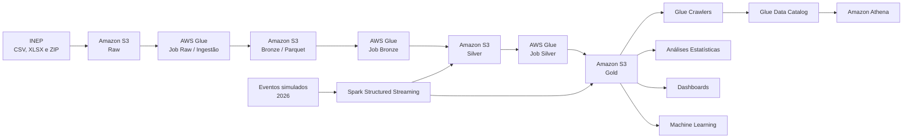

# README

### Contexto deo Problema

A alfabetização na infância constitui uma etapa fundamental para o desenvolvimento educacional e social. No Brasil, o **Compromisso Nacional Criança Alfabetizada** estabelece como objetivo garantir que as crianças estejam alfabetizadas ao final do 2º ano do ensino fundamental, além de apoiar a recomposição das aprendizagens dos estudantes afetados por defasagens educacionais.

O acompanhamento desse cenário depende da integração de diferentes informações educacionais. Resultados de avaliação, metas nacionais, estaduais e municipais e microdados de estudantes são publicados em arquivos com diferentes estruturas, granularidades e padrões de representação.

Essa fragmentação dificulta a construção de análises integradas e reproduzíveis. Comparar o desempenho observado com as metas educacionais, acompanhar a evolução temporal dos indicadores e identificar desigualdades territoriais exige um processo consistente de ingestão, padronização, validação e integração dos dados.

Neste contexto, o projeto propõe uma pipeline de engenharia de dados em nuvem para transformar dados públicos de alfabetização em datasets analíticos confiáveis, rastreáveis e preparados para análises estatísticas e futuras aplicações de Inteligência Artificial.

---

### Desafio Educacional e Indicador de Alfabetização

O projeto utiliza dados da **Avaliação da Alfabetização**, disponibilizados pelo Instituto Nacional de Estudos e Pesquisas Educacionais Anísio Teixeira — INEP.

O principal indicador analisado é o **Indicador Criança Alfabetizada**, construído a partir da escala de proficiência do Sistema de Avaliação da Educação Básica — Saeb.

Na metodologia utilizada, o ponto de corte de **743 pontos de proficiência** representa o nível a partir do qual o estudante é considerado alfabetizado. Esse critério permite calcular taxas agregadas de alfabetização e acompanhar a evolução dos resultados por município e Unidade da Federação.

Entretanto, analisar apenas o indicador observado não é suficiente. Para interpretar o desempenho educacional, é necessário relacionar os resultados às metas estabelecidas para cada território e período.

A pipeline integra dados históricos de **2023 a 2025**, incluindo:

* microdados de alunos;
* indicadores agregados por município;
* indicadores agregados por Unidade da Federação;
* metas nacionais;
* metas estaduais;
* metas municipais.

A integração dessas entidades permite responder questões como:

* quais municípios atingiram suas metas de alfabetização;
* qual é a distância entre o resultado observado e a meta prevista;
* como os indicadores evoluem ao longo do tempo;
* quais territórios apresentam desempenho abaixo do esperado;
* quais bases podem ser utilizadas para futuras análises preditivas e territoriais.

---

### Arquitetura Proposta

Foi implementada uma arquitetura de **Data Lake na AWS**, baseada no padrão **Medallion Architecture**.

A solução combina ingestão **batch** com uma simulação de processamento de eventos em tempo quase real utilizando **Spark Structured Streaming**.

A arquitetura é organizada em quatro zonas de armazenamento:

* **Raw:** preservação dos arquivos capturados diretamente da fonte;
* **Bronze:** aplicação do contrato estrutural e conversão dos dados para Parquet;
* **Silver:** limpeza, padronização, conformação semântica e validação de qualidade;
* **Gold:** materialização das regras de negócio e criação dos datasets analíticos.

O processamento é executado por jobs PySpark no **AWS Glue**, enquanto os dados são armazenados no **Amazon S3**.

Os datasets são catalogados automaticamente por **AWS Glue Crawlers** no **Glue Data Catalog** e podem ser consultados utilizando SQL por meio do **Amazon Athena**.

A infraestrutura e a sequência de execução dos jobs são controladas por scripts Bash e AWS CLI.

---

### Descrição da Arquitetura da Solução

A arquitetura foi construída com separação explícita de responsabilidades entre as camadas.

#### Raw

A camada Raw representa a zona de captura da fonte.

O job de ingestão acessa os arquivos oficiais do INEP e realiza a transferência diretamente para o Amazon S3. Os arquivos ZIP são processados seletivamente para extrair apenas os datasets necessários ao projeto.

A transferência utiliza leitura HTTP em fluxo, evitando carregar integralmente os arquivos em memória. Também foi implementado um mecanismo de retry para falhas de download.

O objetivo da Raw é preservar os arquivos recebidos da fonte antes da aplicação das regras estruturais e semânticas do pipeline.

#### Bronze

A Bronze estabelece o contrato estrutural dos dados.

Os arquivos CSV e XLSX são lidos utilizando schemas explícitos definidos para cada entidade e, quando necessário, para cada ano de publicação. Essa estratégia trata as diferenças de layout identificadas entre os arquivos de 2023, 2024 e 2025.

As colunas são selecionadas por nome. Mudanças aditivas na fonte podem ser ignoradas quando estão fora do contrato, enquanto a ausência ou alteração de uma coluna obrigatória provoca falha explícita do job.

Os dados são convertidos para **Parquet** e particionados pelo ano da avaliação.

Também são adicionados metadados técnicos de rastreabilidade, incluindo o arquivo de origem e o timestamp de ingestão.

#### Silver

A Silver é responsável pela conformação semântica e pela qualidade dos dados.

Nesta camada são executadas operações como:

* normalização de identificadores municipais;
* padronização de tipos;
* tratamento de percentuais;
* interpretação dos códigos de rede de ensino;
* tratamento de valores ausentes;
* validação de unicidade;
* validação de domínio;
* verificação dos anos esperados.

Valores de metas como `>80` são normalizados para representação numérica, mantendo documentada a semântica de que a meta original representa superar 80%.

Nos microdados de alunos, registros sem proficiência recebem valor nulo na classificação de alfabetização. Dessa forma, estudantes sem medição não são classificados incorretamente como não alfabetizados.

A Silver disponibiliza seis datasets conformados:

* metas do Brasil;
* metas por UF;
* metas municipais;
* indicadores por UF;
* indicadores municipais;
* microdados de alunos.

#### Gold

A Gold materializa as regras de negócio e cria datasets orientados ao consumo analítico.

Foram produzidas três tabelas:

### `indicadores_municipio`

Integra resultados municipais, participação e metas.

Disponibiliza métricas como:

* distância até a meta;
* indicador de atingimento da meta;
* categoria de desempenho;
* faixa de participação.

### `indicadores_uf`

Integra resultados e metas por Unidade da Federação.

Permite comparar o desempenho estadual com os objetivos definidos para cada período.

### `aluno_contexto`

Integra os microdados dos estudantes ao contexto municipal.

A tabela disponibiliza uma variável-alvo de alfabetização e classifica as colunas conforme seu papel em futuras aplicações de Machine Learning, incluindo a identificação explícita de variáveis que representam vazamento de informação.

---

### Diagrama da Pipeline

A arquitetura utiliza as mesmas tabelas Silver e Gold para os fluxos batch e streaming. Dessa forma, a ingestão em tempo quase real não cria um contrato de dados paralelo.

---

### Fluxo de Dados

O fluxo batch representa o processamento principal da solução:

1. os arquivos oficiais são capturados das fontes do INEP;
2. os dados são armazenados no bucket Raw;
3. a Bronze aplica schemas explícitos, seleciona as colunas contratadas e converte os dados para Parquet;
4. a Silver normaliza chaves, tipos e regras semânticas;
5. contratos executáveis de qualidade validam os datasets;
6. a Gold integra resultados, metas e contexto educacional;
7. os Glue Crawlers atualizam o catálogo técnico;
8. os dados ficam disponíveis para consulta SQL no Athena.

Os jobs são executados sequencialmente. O orquestrador aguarda a conclusão de cada etapa antes de iniciar a seguinte e interrompe a pipeline quando um job termina em estado de falha.

No fluxo de streaming, um produtor gera eventos simulados de novas medições de desempenho para 2026. Os eventos são gravados periodicamente no S3 e consumidos pelo Spark Structured Streaming em micro-lotes.

Cada micro-lote é transformado para o mesmo schema utilizado pelo processamento batch, deduplicado e integrado às tabelas Silver e Gold.

---

# Tecnologias Utilizadas

| Tecnologia                 | Utilização                                 | Justificativa                                                                                  |
| -------------------------- | -------------------------------------------- | ---------------------------------------------------------------------------------------------- |
| Amazon S3                  | Armazenamento do Data Lake                   | Armazenamento escalável, desacoplado do processamento e adequado a dados brutos e analíticos |
| AWS Glue                   | Execução dos jobs PySpark                  | Processamento serverless sem necessidade de manter clusters ativos                             |
| Apache Spark / PySpark     | Transformação dos dados                    | Processamento distribuído e suporte ao mesmo motor para batch e Structured Streaming          |
| Spark Structured Streaming | Simulação de ingestão quase em tempo real | Permite demonstrar processamento incremental em micro-lotes e checkpoint                       |
| AWS Glue Crawlers          | Descoberta dos datasets                      | Automatiza a identificação de tabelas e partições                                          |
| Glue Data Catalog          | Catálogo técnico                           | Centraliza metadados utilizados pelos serviços analíticos                                    |
| Amazon Athena              | Consulta SQL                                 | Permite consultar diretamente os arquivos Parquet no S3 sem Data Warehouse dedicado            |
| Parquet                    | Formato analítico                           | Armazenamento colunar, compressão e redução da leitura de dados                             |
| Bash                       | Automação da infraestrutura e pipeline     | Permite controlar provisionamento e sequência operacional dos jobs                            |
| AWS CLI                    | Interação programática com a AWS          | Automatiza criação, atualização e execução dos recursos                                  |
| Git                        | Versionamento e rastreabilidade              | Mantém o histórico das alterações de código, schema, regras e infraestrutura              |

As tecnologias foram selecionadas considerando o ambiente AWS Academy Learner Lab, o volume atual dos dados e a necessidade de demonstrar uma arquitetura cloud reproduzível sem manter infraestrutura computacional permanentemente ativa.

---

# Decisões Arquiteturais e Trade-offs

## Batch versus Streaming

O processamento batch é a estratégia operacional mais adequada à fonte utilizada.

Os dados oficiais da Avaliação da Alfabetização possuem periodicidade anual. Dessa forma, manter um processamento de streaming continuamente ativo aumentaria o custo e a complexidade operacional sem uma fonte contínua de eventos que justificasse esse modelo.

Por esse motivo, o cenário operacional e a estimativa de FinOps consideram **uma execução batch anual**.

Entretanto, o desafio propõe a simulação de ingestão de eventos em tempo quase real. Para demonstrar esse padrão, foi implementado um fluxo de novas medições de desempenho utilizando Spark Structured Streaming.

O streaming processa arquivos em micro-lotes e integra os eventos às mesmas tabelas Silver e Gold utilizadas pelo batch.

A implementação é deliberadamente finita: após a geração dos eventos, os micro-lotes pendentes são processados e o stream é encerrado.

Em um cenário produtivo, a adoção de streaming contínuo dependeria da existência de uma fonte com maior frequência de atualização e de requisitos de latência que justificassem o processamento quase em tempo real.

Também seria necessário avaliar o volume e o tamanho dos eventos. Um crescimento baseado em grande quantidade de arquivos pequenos poderia exigir mecanismos de compactação ou agrupamento em lotes maiores.

## Data Lake versus Data Warehouse

Foi escolhido um Data Lake devido à heterogeneidade das fontes e à necessidade de preservar dados em diferentes níveis de tratamento.

Os arquivos de origem incluem ZIP, CSV e XLSX, além de microdados com milhões de registros. O Amazon S3 permite armazenar esses dados com baixo custo e separar fisicamente as zonas Raw, Bronze, Silver e Gold.

Um Data Warehouse dedicado forneceria maior especialização para cargas analíticas estruturadas e cenários de alta concorrência. Entretanto, para o volume e o padrão de acesso atual, introduziria um componente adicional de infraestrutura sem benefício proporcional.

A combinação S3, Glue Data Catalog e Athena atende ao consumo analítico atual sem exigir um banco analítico permanentemente provisionado.

## Custo versus Performance

Os jobs Bronze, Silver e Gold utilizam recursos computacionais dimensionados para o volume atual da solução.

O uso do Apache Spark representa uma infraestrutura distribuída mais robusta do que o volume total armazenado estritamente exigiria. Entretanto, a solução processa aproximadamente seis milhões de registros de alunos e utiliza o mesmo motor para processamento batch e Structured Streaming.

A escolha também permite demonstrar uma arquitetura preparada para crescimento futuro dos microdados.

Para reduzir o custo analítico, os datasets são convertidos para Parquet e particionados por ano. A conversão entre Raw e Bronze reduz o volume de aproximadamente 621 MB para 70 MB, uma redução próxima de 88,7%.

A arquitetura aceita o tempo de inicialização dos jobs serverless como trade-off para evitar recursos computacionais permanentemente ativos.

---

# Monitoramento da Pipeline

A observabilidade é implementada por meio de logging operacional padronizado e controle explícito do estado dos AWS Glue Jobs.

Os jobs enviam logs para `stdout`, centralizados pelo AWS Glue no Amazon CloudWatch Logs.

São registrados eventos como:

* início e conclusão dos jobs;
* falhas de ingestão;
* tentativas de retry;
* datasets gravados;
* quantidade de registros processados;
* resultado dos checks de qualidade;
* score de qualidade por tabela;
* micro-lotes processados pelo streaming;
* falhas críticas.

As validações de qualidade utilizam estados `PASS`, `WARN` e `FAIL`.

Uma regra não crítica pode gerar um alerta e permitir a continuidade do processamento. Uma violação crítica dispara uma exceção e interrompe o job.

O orquestrador também acompanha os estados dos Glue Jobs. Estados de falha, erro ou timeout interrompem a sequência de execução, impedindo que uma camada posterior processe dados cuja etapa anterior não foi concluída corretamente.

Essa abordagem permite identificar a etapa da falha e investigar sua causa por meio dos logs operacionais.

---

# FinOps e Controle de Custos

A estratégia de FinOps considera o perfil real da fonte: atualização anual e volume total inferior a 1 GB.

O cenário-base utiliza **uma execução anual do pipeline batch**.

Os volumes medidos no Data Lake são:

| Camada          |           Volume |
| --------------- | ---------------: |
| Raw             |           621 MB |
| Bronze          |            70 MB |
| Silver          |            69 MB |
| Gold            |            67 MB |
| Scripts         |            29 MB |
| **Total** | **856 MB** |

Os quatro jobs batch representam aproximadamente **US$ 0,10 por execução anual completa**.

Considerando também três execuções anuais dos Crawlers, o custo estimado de processamento e catalogação é de aproximadamente **US$ 0,54 por ano**.

Incluindo armazenamento S3, uma premissa conservadora de 10 GB mensais escaneados no Athena e margem para requisições S3, o custo anual estimado permanece inferior a aproximadamente **US$ 2,60**.

As principais decisões de otimização são:

* armazenamento em Parquet;
* particionamento por ano;
* uso de column pruning;
* uso de partition pruning;
* execução dos jobs somente quando necessária;
* processamento batch alinhado à periodicidade da fonte;
* uso de Glue serverless;
* atualização dinâmica apenas das partições afetadas;
* execução dos Crawlers associada à atualização das camadas.

O streaming não integra o cenário-base de custos, pois representa uma simulação técnica do requisito de arquitetura híbrida.

Sua adoção operacional deverá ser reavaliada caso a frequência, o volume ou os requisitos de latência das fontes sejam alterados.

---

# Aplicação em Inteligência Artificial

A camada Gold foi construída para funcionar como fronteira entre a engenharia de dados e futuras aplicações analíticas e de Machine Learning.

## Modelos de Predição de Alfabetização

A tabela `aluno_contexto` disponibiliza `label_alfabetizado` como variável-alvo.

A base permite estruturar um problema de classificação para investigar padrões associados à alfabetização dos estudantes.

Entretanto, variáveis como `proficiencia` e `gap_proficiencia` são diretamente relacionadas ao critério utilizado para construir o alvo e representam vazamento de informação. Essas variáveis devem ser excluídas das features de um modelo preditivo.

Uma evolução do projeto seria integrar variáveis explicativas provenientes de fontes externas, como:

* indicadores socioeconômicos;
* infraestrutura escolar;
* características territoriais;
* vulnerabilidade social;
* financiamento educacional.

Com esse enriquecimento, seria possível desenvolver modelos para estimar risco educacional e identificar padrões associados a menores probabilidades de alfabetização.

## Análise de Desigualdade Educacional

As tabelas `indicadores_municipio` e `indicadores_uf` permitem comparar resultados entre territórios e períodos.

Métricas como `distancia_meta`, `atingiu_meta` e `categoria_desempenho` podem ser utilizadas para identificar regiões persistentemente abaixo das metas.

A integração futura com indicadores socioeconômicos e territoriais permitiria investigar relações entre vulnerabilidade e desempenho educacional.

Também seria possível utilizar técnicas de clusterização para agrupar municípios com características semelhantes e identificar diferentes perfis de vulnerabilidade educacional.

## Políticas Públicas Baseadas em Dados

Os datasets Gold podem apoiar o acompanhamento de metas e a priorização de territórios.

Municípios com maior distância negativa em relação às metas podem ser identificados e acompanhados ao longo do tempo.

Com o enriquecimento da base, análises e modelos poderiam subsidiar:

* priorização de municípios com maior risco educacional;
* direcionamento de programas de apoio;
* alocação de recursos;
* identificação de desigualdades territoriais;
* acompanhamento da evolução após intervenções;
* avaliação de padrões associados ao desempenho educacional.

A proposta não é substituir a decisão de política pública por um modelo automatizado, mas disponibilizar uma base de dados confiável e integrada para apoiar decisões orientadas por evidências.
